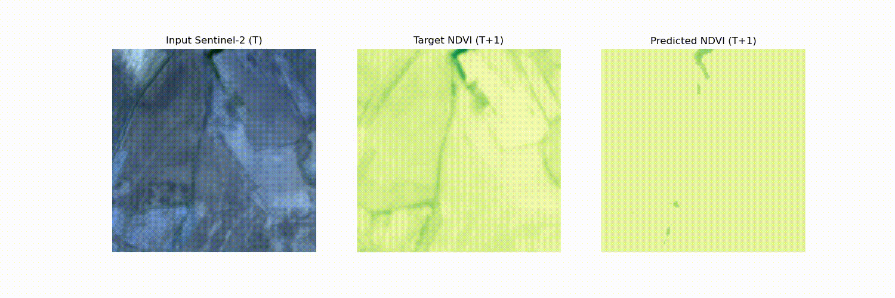
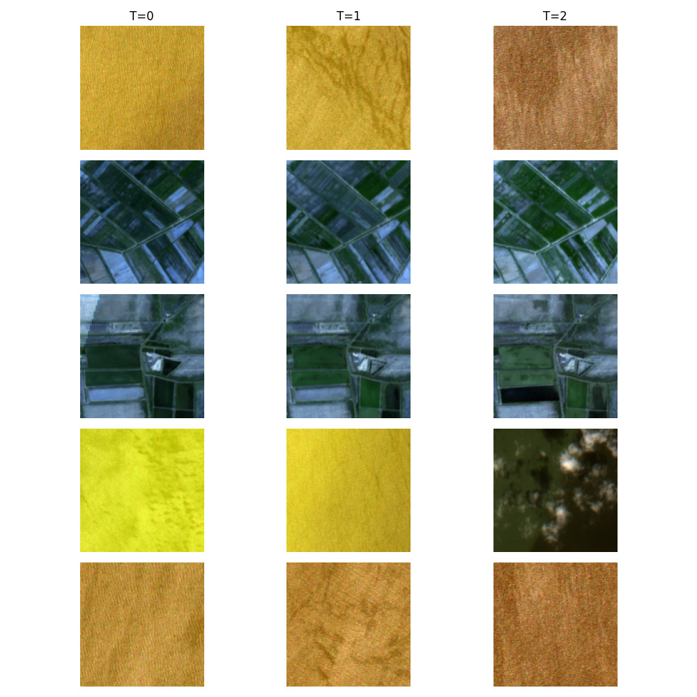

# Healing Factor

This project uses Microsoft Planetary Computer's Sentinel 2 satellite imagery to predict the Normalized Difference Vegetation Index (NDVI). This metric serves as a proxy for restoration progress in war-affected regions, specifically in Ukraine, and suggests where additional interventions might be most beneficial. The work was developed during the EcoHack Hackathon "AI & LLM Hackathon for Applications in Evidence-based Ecological Research & Practice" at the Zentrum für interdisziplinäre Forschung (Bielefeld, Germany). 



## Challenge

The war in Ukraine has wreaked havoc on local ecosystems. Huge areas of forest were burned, water bodies were polluted with rocket fuel and deliberately poisoned, and wildlife was forced to adapt to numerous new anthropogenic factors. The destruction of the Kakhovka Dam by Russian forces dramatically altered the geography of the region, exposing previously submerged land and flooding new areas. In a disaster of this magnitude, recovery efforts rely heavily on extensive human labor and low-tech solutions. This reality limits the practical application of machine learning models for direct disaster response. 
In addition, government planning for disaster recovery is strictly regulated by official protocols and legal frameworks. These procedures leave little room for relying on novel ML-based approaches for operational planning or resource management on the ground. The scale of the disaster and the regulatory environment mean that sophisticated digital solutions such as chatbots or wearable devices for workers are not viable, as they would conflict with standardized, low-tech field operations.

## Idea

Given these constraints, the most realistic digital contribution is not to transform hands-on work, but to provide strategic insights to optimize resource allocation. Specifically, a machine learning model could be developed to assess whether efforts applied to a particular site have reached a level where the ecosystem is on a path to recovery, or whether additional intervention is still needed. If made publicly available, such information could enable civil society organizations to put pressure on the government and steer efforts in the right direction. While more effort generally correlates with better restoration outcomes, resources are finite. There is a critical trade-off between the intensity of intervention (which can lead to higher quality restoration) and the breadth of coverage (ensuring that more areas are addressed).
An ML model focused on this trade-off could:
1. Analyze historical and current ecological data, remote sensing imagery, and field reports to estimate restoration progress in targeted areas.
2. Predict the marginal benefit of additional human intervention in specific locations, helping decision makers determine where additional resources will have the greatest impact.
3. Provide a data-driven basis for allocating funds and efforts more efficiently, maximizing ecological recovery per unit of resources expended.

## Overview

1. **Data**: The code retrieves and preprocesses Sentinel-2 satellite imagery within a specified bounding box and date range. Monthly “mosaics” are created by merging multiple satellite scenes using a pixel-wise median. The data used in the model are four spectral bands: B02 (Blue), B03 (Green), B04 (Red) and B08 (Near Infrared).

2. **Preprocessing**: 
   - **Monthly Date Binning**: Given start and end dates, the code iterates month by month, creating date ranges.  
   - **Scene Filtering**: From Planetary Computer’s STAC API, the code selects scenes with low cloud cover (up to a maximum number per month).  
   - **Mosaicking**: Each month’s scenes are merged pixel-by-pixel using a median function for each band, resulting in a single 4-band GeoTIFF per month.  
   - **Time-Series Windowing**: A spatiotemporal dataset is formed by slicing each monthly mosaic sequence into windows of length 3. For each window, the target is the NDVI of the following month.  
   - **Patch Extraction**: The code subdivides each spatiotemporal sample into patches (default size `128×128`).  

3. **Model**:  
   - **Architecture**: A **ConvLSTM** cell that handles spatial (`H×W`) and temporal (`T`) dimensions.
   - **Output**: After processing all timesteps, the model outputs a single channel representing **predicted NDVI** for the subsequent month.  
   - **Loss**: Loss computed via Mean Squared Error (MSE) between predicted NDVI and ground truth NDVI.
   


## Next Steps

Currently, the project only uses NDVI as a proxy for evaluating ecosystem health. While NDVI can provide a rough measure of vegetation status, a more comprehensive approach is needed to capture the full complexity of ecosystem restoration, especially one that includes water quality, soil contamination, biodiversity indices, and other ecological parameters.   
Because processing the large, high-resolution satellite imagery is a computationally intensive process, it would not be efficient to provide the restoration maps as an interactive service. Instead, the pre-computed maps could be periodically updated and distributed via a web service.

## Getting Started

**Environment Setup**  
   - Install Python >= 3.8.  
   - Install required dependencies:  
     ```bash
     pip install -r requirements.txt
     ```

**Usage**  
   - Edit bounding-box coordinates, date ranges, and other hyperparameters directly in the command-line or in `main.py`.  
   - Run:
     ```bash
     python main.py
     ```
   - Mosaic files are saved in the specified `--data_dir`. Training patches are stored in subdirectories.  
   - After training, the best model weights are saved as `best_model.pth`, and inference data for visualization are stored in `animation_data.npz`.


